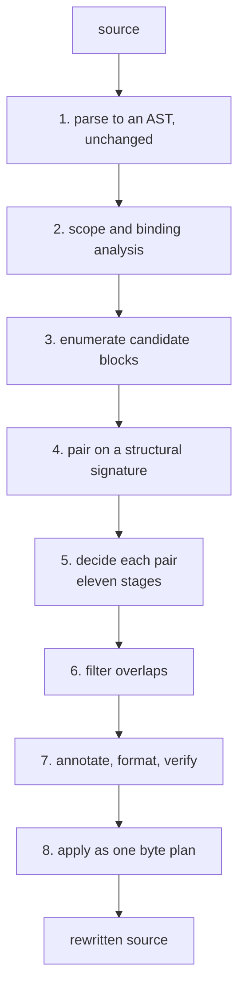
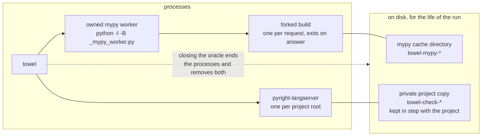
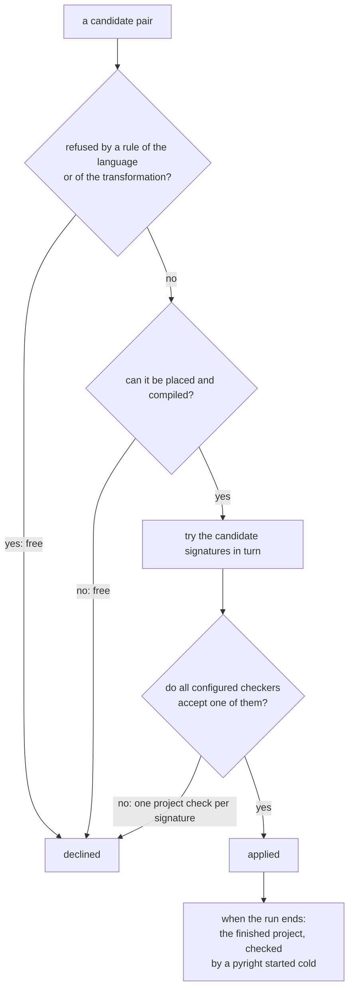
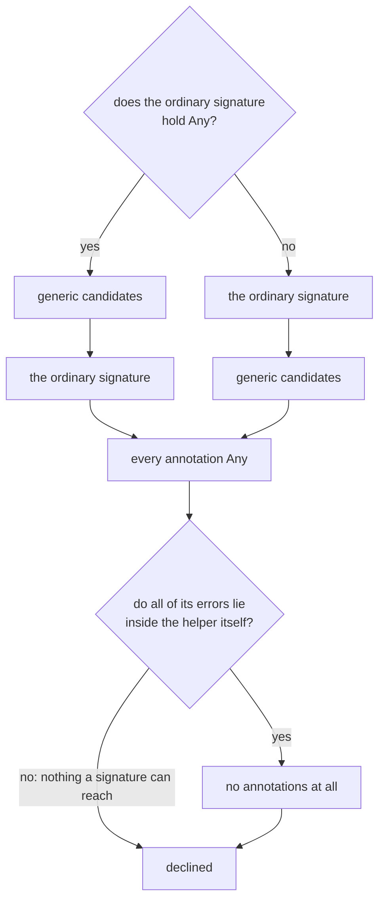
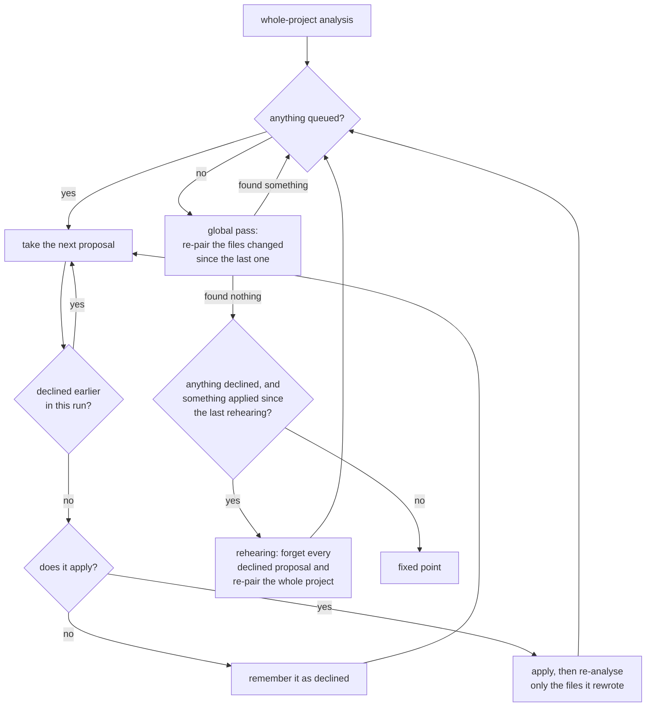

# Towel refactoring architecture

Towel finds repeated Python code by unifying statement blocks, extracts each
family of duplicates into one helper function, and rewrites the duplicates as
calls. It is a source-to-source transformation tool. Its design goal is not to
transform as much as possible; it is to transform only where a syntactic,
local argument shows the result is preserved, and to reject everything else.
The checks below are all syntactic and lexical: they do not establish general
behavioral equivalence for programs that observe their own frames, names, or
source, so the intended use is preview, review the diff, and run the project's
own tests.

The engine is `UnificationRefactorEngine` in
[`refactor_engine.py`](../src/towel/unification/refactor_engine.py). It is
assembled from mixins, one module per responsibility (block analysis, the
pair decision, placement, reuse, insertion points, annotation wiring,
materialization, clustering, parallel evaluation, the fixed-point drivers).
Each mixin inherits the mixins it calls, so the call graph is the class
hierarchy: the pair decision builds on block analysis, clustering,
placement, reuse and annotation wiring; materialization on insertion
points, placement, reuse and annotation wiring; the drivers on
materialization; parallel evaluation on the drivers and the pair
decision; and the engine on parallel evaluation. All of them share
[`engine_state.py`](../src/towel/unification/engine_state.py), which
declares the attributes every mixin may rely on and the operations the
core module provides (parsing, structural ids, the rejection trace, the
cache index, the analysis entry points), so mypy checks the seams. The
core module keeps the constructor, the caches, the analysis entry points,
block enumeration, and pairing.

## Measurement environment

Every time, memory and disk figure in this document was measured on an Apple
M5 Max with 18 cores and 128 GiB of memory, writing to an APFS internal
volume. Unless a figure says otherwise it was taken with the machine
otherwise idle and with Towel's CLI defaults, and a figure that names a
commit was taken at it.

Where a figure concerns a project Towel was checking, the checker is that
project's own rather than Towel's: the Sphinx measurements run mypy 1.19.1
and pyright 1.1.407 from Sphinx 9.1.1 at `e44a40e`, and the mypy costs they
describe belong to that version.

## The pipeline

A single analysis runs these phases; the directory driver wraps them in a
fixed-point loop (below).

1. **Parse.** Read source and parse it to an AST, unchanged. Operators and
   assignment forms are preserved; no normalization runs on the analyzed tree.
2. **Scope and binding analysis.** `scope_analyzer.py`, `binding_detector.py`,
   `assignment_analyzer.py`, and `visitors.py` build the module, class, and
   function scopes and record where every name is bound, read, deleted, or
   declared `global`/`nonlocal`.
3. **Enumerate candidate blocks.** Contiguous runs of statements inside each
   function body become candidate blocks. Blocks that can never be accepted are
   never enumerated (see *Enumeration filter*).
4. **Pair.** `block_signature.py` computes a cheap structural signature per
   block; `find_block_pairs` buckets blocks on their statement-type sequence
   and rejects incompatible pairs before the expensive step, and, when the
   projected pair count exceeds `--max-pairs` (20,000,000 by default), leaves
   out the largest buckets of similar blocks with a warning naming them
   (`_buckets_over_budget`).
5. **Decide each pair.** `pair_evaluation.py` runs eleven stages, each
   returning a typed result or a traced rejection:
   1. guards on the blocks themselves (`semantic_safety.py`: frame use in
      the block or elsewhere in its function, async comprehensions, loop
      transfers, closures over a rebound name, moved `global`/`nonlocal`
      declarations; see *Guards*);
   2. binding analysis of each block within its function, and the variables
      later code reads that the helper must return; a block that reassigns,
      deletes or `except ... as`-binds a name bound before it is declined
      here;
   3. the shape check: both blocks value-producing or neither, complete
      return coverage, structurally similar;
   4. unification (`unifier.py`, below) and alignment of the returned
      variables across the blocks;
   5. where the helper will be visible from, for hygienic naming;
   6. the helper's free variables: a returned variable must be definitely
      bound at the block's exit; a free name bound after the block declines;
      the shared names both sites resolve at module scope are read bare
      (same-module helpers only) and exempt from the module-data and
      rebinding-hazard guards, which decline the rest; `global`/`nonlocal`
      declarations; and any name the call site may not resolve becomes a
      thunk;
   7. rendering the helper (`extractor.py`), and dropping one too trivial
      to share, decided in one place (`_trivial_helper_reason`): one that
      computes nothing, only handing back its parameters, literals, tuples of
      them or its sites' thunks, and one that only calls generated helpers,
      in every configuration; and one whose body only forwards: a lone
      `raise`, a `return` of one call, a bare call, a call whose result is
      bound and returned, or a body that only binds parameters and literals
      to names and returns them (`skip_trivial_helpers=False` keeps these);
   8. the orphan check (`orphan_detector.py`, `definite_assignment.py`) on
      what the blocks leave behind;
   9. the call sites, each verified by instantiating the helper with its
      arguments and comparing the result with the block it replaces, up to
      renamed binders (see *The soundness invariant*), plus the further
      same-file sites that can share the helper (`clustering.py`); a call
      that would pass a callee as `lambda *args, **kwargs: callee(*args,
      **kwargs)`, or that names something the site cannot resolve, declines
      the pair (`forwarded_callee`, `undefined_names_in_call`);
   10. placement: function, class, or module, and a host module that closes
       no import cycle and whose import runs no module code the borrower's
       imports do not already run (a module-level helper may move to
       another participating module); a cross-module helper is refused when
       a participating module declares a `global` or the layout is unknown
       (`_safe_home_across_modules`; see *Helper placement* and
       *Cross-file*);
   11. the proposal: one whose helper, home and sites repeat an earlier
       pair's is declined (`duplicate_proposal`, the engine's
       `_seen_proposals`) before anything further is computed for it; the
       rest is redirected to an existing function when a site is one (see
       *Reusing an existing function*), declined when it would reduce a
       helper from an earlier pass to a forwarder, then annotated. A proposal that survives those stages is declined once more if it would
   separate a narrowing test from an expression it leaves at the call site
   (`unification/narrowing.py`), which is a property of the transformation
   rather than of the project's types and so holds with checking off.
6. **Filter overlaps.** `overlap.py` keeps a non-overlapping set of the
   accepted proposals, largest first.
7. **Annotate, format, verify.** `annotations.py` gives the helper the
   annotations its call sites declare and, through the project's type
   checker, the types of the rest (see *Helper annotations*); the project's
   formatter formats each inserted snippet and its import sorter finishes
   each modified file (see *Generated code formatting*); the generated
   Python is compiled to confirm it parses, overlapping replacements are
   detected, and with type verification enabled all prospective files are
   checked together with unchanged consumers. A precise ordinary signature is
   tried first. Type anti-unification supplies generic candidates before an
   `Any`-containing signature or after a precise ordinary signature fails.
   Annotations finally fall back to `Any` and then to none on new errors;
   every variant must pass before application.
8. **Apply.** `changes.py` turns accepted proposals into an immutable byte
   plan and applies it transactionally (see *Application and recovery*).

`models.py` defines the data that flows between stages: raw and parsed
modules (a `RawModule` is a file read and parsed; a `ParsedModule` has its
scopes analyzed and is what every later phase consumes),
function artifacts, class info, code-block pairs, replacements, and
proposals; `substitution.py` defines the substitution the unifier produces.

## The core algorithm: anti-unification into a helper

Two blocks unify when they have the same statement shape and differ only in
sub-expressions that can be abstracted into parameters. This is *anti-unification*,
also called least general generalization [Plotkin 1970; Reynolds 1970]:
the template is the most specific pattern both blocks instantiate. The unifier walks both
ASTs in lockstep. Where the trees agree it keeps the structure; where they
differ it introduces a parameter, provided the differing nodes are expressions
that can be abstracted safely. Binder names (loop variables, comprehension
targets, `with`/`except` names) are matched up to consistent renaming rather
than turned into parameters.

Each parameter is passed in the way that preserves the original evaluation:

- **Value.** A literal, a signed or negated literal (`-1`, `not True`), a
  name the call site resolves on every path, or a tuple of those is passed
  eagerly. It has no observable effect and no fresh identity, so evaluating
  it at the call site is indistinguishable from evaluating it in place. A
  name the site may not resolve (a local bound only on some path before the
  block, a module name bound later or nowhere, a cell of an enclosing
  function not yet filled) is a thunk instead, so it is read where the block
  read it; this applies to a differing argument, and to a shared free
  variable that is a local or an enclosing function's cell, or, for a
  cross-file helper, a module name (`available_argument_names` in
  `semantic_safety.py`). A shared module name of a same-module helper is
  read bare instead (next bullet).
- **Module name.** A free name that both sites resolve at module scope, or
  nowhere, is not a parameter of a same-module helper: the helper reads it
  bare, which is the same lookup the block made, at the same moment
  (`module_resolved_names`). This covers helpers defined below their callers,
  classes, imports, and module data that another function rebinds through
  `global`. A clustered occurrence joins only where every such name resolves
  the same way. A cross-file helper keeps them as parameters, since the
  other module's same-named binding may differ, and so does a helper that
  placement (stage 10) hosts in an ancestor class defined in another
  module: the driver notices the move and decides the pair again from
  unification with every name a parameter (`_unify_and_place`).
- **Thunk.** Any other expression is passed as a zero-argument lambda (a *thunk*
  [Ingerman 1961]) and called inside the helper exactly where the original
  expression stood. This
  preserves evaluation order, count, and conditionality: an expression the
  original evaluated twice, or not at all on some path, is evaluated the same
  number of times under the same conditions. As an optimization, a thunk the
  helper would evaluate first, once, and unconditionally is passed eagerly
  instead, because nothing can observe the difference.
- **Lifted.** An expression that reads a name bound *inside* the block is
  lambda-lifted [Johnsson 1985]: the lambda takes those names as arguments so it still refers
  to the block-local values, not to whatever the helper's scope binds.
- **Receiver.** When the helper becomes a method, the instance or class is
  passed as the receiver (see *Helper placement*).

The result is a `Substitution` (in `substitution.py`): the template, the ordered
parameters, and, per parameter, the argument expression at each call site and
its kind. `unifier.py` refuses to parameterize a node that is not an
`ast.expr` (a slice, a starred item, a whole f-string), because those are
container syntax, not values. Nor does it parameterize what a tool reads
where it stands (`static_positions.py`): a translation marker's message, or
what a checker reads of a typing form, such as `cast`'s type or a
`TypeVar`'s name. A form is whatever the block's module binds to typing's
object, however it is imported (`typing_forms.py`), so `t.cast(Alpha, v)`
after `import typing as t` is one and sqlglot's own `exp.cast(column, to)`
is not.

## The soundness invariant

Acceptance never trusts the algorithm; it checks the result.
`instantiation.py` takes the generated helper, substitutes each call site's
actual arguments back into the helper body, alpha-normalizes both it and the
original block (binders renamed to positional placeholders, i.e. compared up to
alpha-equivalence [Church 1936; Barendregt 1984], annotations
replaced by a placeholder because they are inert at runtime), and requires the
two to be structurally identical. A proposal is offered only if this holds for
**every** call site. This is the property that makes the transformation safe to
apply after review: the helper, called as written, reduces to the exact code it
replaced. A mismatch — from a subtle scoping or parameterization error — drops
the proposal rather than emitting it.

## Scope, binding, and liveness

Extraction must not orphan a name. A forward dataflow *definite-assignment*
analysis [Gosling et al., Java Language Specification ch. 16; cf. Nielson,
Nielson & Hankin 1999] answers which names are guaranteed bound at a point.
`definite_assignment.py` provides
`definitely_bound_after(statements)`: the set of names guaranteed bound after a
run of statements, or `None` if control cannot fall through (every path
returns, raises, breaks, or continues). `orphan_detector.py` uses it
path-sensitively: for each statement remaining after the extracted block, it
subtracts the names *definitely* bound on the way to that statement from the
names the block bound and the remaining code reads. A name the block binds and
later code reads is safe to move into the helper only when every path from the
block's end to that read rebinds it first; a name rebound on only some paths is
treated as orphaned and the block is rejected. `extractor.py`'s
`has_complete_return_coverage` similarly requires a value-producing block to
return on every path before it may be called as `return helper(...)`, using
both the rendered shape and the all-paths-exit property.

A name the block binds to a class instantiation (a capitalized callee) or to
one of a short list of resource factories (`open`, `connect`, `socket`,
`mkdtemp`, `Popen`, `urlopen`, ...) is returned from the helper and rebound
at the site whether or not later code reads it, so the object is not
finalized when the helper's frame ends: a temporary file read after the
block, a weak reference, a `__del__` (`lifetime_bound_names` in
`block_analysis.py`). A factory outside that list is not detected.

### The visitors

Every AST visitor in the package is built on one of three bases in
`visitors.py`, each a Template Method: the base fixes the traversal, the
subclass supplies the hooks. `OwnScopeVisitor` reads one scope's own code
and hands a nested function, class, lambda, or comprehension to a hook,
whose default is not to enter a function and to enter the rest, since they
run where they stand. `DefinitionDepthVisitor` enters every definition and
announces it to hooks with the enclosing depth. `ScopeVisitor` is for the
analyses that follow lexical scopes (`ScopeAnalyzer`, its free-variable
walker, `BindingDetector`, the rename tool's scope map): it visits a
definition's head in the enclosing scope, binds its name there, enters the
scope, binds parameters, visits the body, leaves, and visits the tail; a
comprehension evaluates its first iterable outside and binds every target
inside before the remaining iterables, conditions, and result. An analysis
that must deviate (the scope analyzer keeps a lambda's body in its enclosing
scope, the walker does not enter a class body, the binding detector records
comprehension targets against the enclosing scope node) overrides the hook
and says why.

## Guards

`semantic_safety.py` rejects a block, before verification, when moving it into
a helper could change behavior even if the shapes match:

- **Frames and suspension.** `yield`, `await`, `async for`/`with`, an async
  comprehension, `locals()`, `globals()`, no-argument `vars()`/`dir()`/
  `super()`, `eval`/`exec`, direct frame or stack inspection, and
  `warnings.warn` (with a `stacklevel`, or without one, since the helper's
  frame would then be the one attributed) — a helper adds a frame these
  would observe. The frame-reading builtins and `eval`/`exec` decline the
  block when they appear anywhere in the enclosing function, not only
  inside the block: a `locals()` after the block sees the names the block
  bound, which a helper would bind in its own frame; a `sys._getframe()` or
  `inspect.currentframe()` outside the block is a handle to those locals
  and declines the same way (`frame_read_outside_block`). A name that
  reaches one of these through a binding is resolved through the module's
  bindings, so the alias is caught as the builtin would be: aliases include
  imports (`import builtins as bi`, `from warnings import warn as w`) and
  assignments (`e = eval`, `warn = warnings.warn`, `gf = sys._getframe`),
  followed to a fixed point over the module, so an alias of an alias is
  one; any call with a `stacklevel=` keyword counts as a warning. A
  `break` or `continue` whose loop lies outside the block would leave the
  helper instead of the loop.
- **Binding discipline.** A block that deletes, rebinds, or `except ... as`
  binds a name the caller keeps using; a moved `global`/`nonlocal`
  declaration; a comprehension assignment expression that would bind in the
  wrong scope.
- **Closures.** A nested function or lambda in the block that shares a rebound
  name with it, or that would capture a different cell after extraction.
- **Import cycles.** A cross-file helper whose new import would close a static
  import cycle (see *Cross-file*).

Only constructs written in the block or its enclosing function, directly or
through an alias the bindings resolve, are caught here; frame use reached
through a callee is handled by the pre-run scan (below), and reflection
reached through a callee or a dynamic lookup is outside the model.

## Helper placement

A helper is inserted where every call site can see it. `placement.py`
decides:

- **Method.** When both blocks are methods of one unique module-level class,
  or of classes with a unique module-level common ancestor, every decorator is
  known to preserve the receiver, and the first parameter is `self` (or the
  method is a `classmethod`), the helper becomes a method and the receiver is
  passed explicitly. A source method that never reads an attribute of its
  receiver, and a `staticmethod`, get a module-level helper instead: such a
  method runs when it is called through its class with anything in the
  receiver's place, and a helper reached through `self` would take that away
  while no checker said so. A static method in the class would have to be
  reached through something, and nothing a method can spell is sure to be its
  class -- the class's name can be a parameter, deleted, rebound, mangled,
  bound to what a decorator returned, or not bound yet while the class body
  runs, and mypy does not know `__class__`. Where one method of a pair
  dispatches and the other does not, the module function serves both.
- **Common ancestor by the binding in effect.** A base-class name is resolved
  the way the referencing module resolves it *at the point the class statement
  runs*: the name must be bound there by an unconditional class statement of
  that module, or by one of that module's own unconditional module-level
  imports (relative, absolute, aliased, or dotted). Position is the whole of
  it, because Python binds globals as the module executes: with `Base = object`
  written between two subclasses, the name denotes one thing where the first
  is defined and another where the second is, and a helper hoisted into the
  class the first sees is not a method of the second at all. A binding that
  cannot be established there -- conditional, declared `global` by some
  function, possibly replaced by a star import, or made in the same top-level
  statement as the reference -- yields no ancestor, and the helper goes to
  module level. A name is never matched across the project, so a project with
  several same-named base
  classes (a `BaseEndpoint` per protocol) does not misattribute the ancestor.
- **Module level otherwise.** When the blocks are in local classes, nested
  functions, or functions whose common enclosing function name is not unique in
  the file, the helper is hoisted to module level. Every free variable is a
  parameter or a module name read bare, so a module-level helper is always
  a correct fallback, and it avoids placing a helper in a scope that a
  same-named sibling function cannot see.
- **After the definitions its annotations name.** A module-level helper goes
  before the module's first definition, after its imports and docstring.
  When its annotations name classes or functions of the module, it goes
  after the last of them instead, so the names are written bare rather than
  as quoted forward references; this is done only when every statement
  before that point is a definition, import, assignment, or docstring, or
  an `if` or `try` made only of those (a `TYPE_CHECKING` guard, an optional
  import), so no statement that could call into the module at import time
  is reordered relative to the helper (`placeable_after`). Otherwise the
  helper stays at the top and the names are quoted.

## Reusing an existing function

A pair whose block is the entire body of a plain module-level function is
not a case for a new helper: the helper would restate that function. The
engine (`_redirect_to_existing_function`) instead keeps the function and
rewrites the other sites to call it, so two identical functions become one
function and a one-line forwarder, and a matching block inside a larger
function calls the existing function directly. Arguments follow the
function's parameter order; names the body reads from its own module
(functions, classes, absolute imports) are ambient there and are not passed.
The existing function must be defined unconditionally at module level,
without decorators, not `async` (the sites are synchronous), not variadic,
and never rebound or deleted; otherwise the pair falls back to ordinary
extraction. A block that binds variables read after it qualifies when the
function ends by returning exactly those names, in any order: the other
sites then unpack the function's result in its order. When both halves of
the pair are whole bodies, the first-defined function is kept. Across files
the call is imported like a helper and refused when it would close an
import cycle, by the same guard. The redirect rests on the helper's own
verification rather than repeating it: the helper has already been shown,
by instantiation, to reproduce every site; at the function's own site the
generated call passes each of the function's positional parameters exactly
once by name, so the helper applied to those arguments is the function's
body, and the function applied to any site's parameter arguments is the
helper applied to them, provided the remaining arguments are the same
module-level objects at every site (`_reuse_plan` checks both). After
rendering, every generated call is checked to bind exactly the function's
positional parameters, against its last definition when `@overload` stubs
precede it. `reuse_existing_functions=False` restores extraction.

## Helper annotations

`annotations.py` annotates a helper only in code that already uses
annotations among its call sites, and only from evidence.

*Copying.* A parameter is annotated when every site passes an annotated,
never-rebound parameter of its enclosing function, or a literal of one
builtin type; the return when every site's function declares a return type
the helper's `return` becomes, when the helper returns locals the block
annotated, or as `None` when it returns nothing. Copying does not reason.

*Inference through the project's checker.* A `TypeOracle`
([`type_inference.py`](../src/towel/type_inference.py)) answers three
questions: what type an expression has at a point in a module
(`reveal`), whether one type is a subtype of another (`is_subtype`), and
whether a prospective project type-checks (`check_project`). Results distinguish
`CheckFailure` from `CheckSuccess`, whose diagnostics carry project paths.
`MypyInferrer` builds a copy of the
site's module in an owned worker process, each build in a forked child of it
that exits once it has answered, with `reveal_type(...)` probes inserted where the
call will stand, so names resolve as they do at the call, and asks
subtyping through probe functions `def _probe(v: narrow) -> wide: return v`
appended to the module, so the relation is mypy's own. The build runs with
the project's configured plugins, loaded by mypy's own loader in each forked
build (`_load_configured_plugins` in `_mypy_worker.py` is the one place that
decides this), since a plugin changes what an expression's type is; one that
cannot be loaded fails the check, so the baseline refuses the run. `PyrightOracle`
does the same through one long-lived `pyright-langserver` per project,
watching a private copy that follows the project; the pyright command line is
the fallback when no server can be started.
`type_oracle_for_project` picks the checker the project configures: mypy
for `[tool.mypy]` or `mypy.ini`, pyright for `[tool.pyright]` or
`pyrightconfig.json`, and for a project configuring both, mypy infers
and both verify, so the project's own check stays green. Every configured
checker must accept, so the first to reject settles the candidate and the
others are not asked; only an accepted candidate is seen by all of them. When
a run that was checked through a language server has applied something -- ever,
not only if one is still warm -- the finished project is confirmed once more by
a pyright started from nothing. A confirmation that cannot itself run has
confirmed nothing and refuses the run rather than passing quietly.

A typed run holds more than the one process it started in:

Before using the oracle, the engine checks the complete original project.
If that completed check reports type errors, it aborts with an instruction to
fix the errors or explicitly rerun with `--no-types`. That option disables
helper annotation generation, inference and verification while preserving
existing source annotations. A checker crash, timeout or incomplete result is
a distinct `CheckFailure` and does not permit unchecked application, and says
the same thing about how to proceed. A clean baseline keeps verification
enabled, so errors introduced by a transformation cannot subsequently be
treated as pre-existing errors that disable checking.

*What "complete" covers.* A checker config that names its own `files` settles
it: the project has said what it checks. mypy takes its targets on the command
line, so most configs name none, and the check then covers the packages the
analyzed files belong to, everything mypy reaches by following imports out of
them, and the modules that import *into* them. That last set is found by
`towel.consumers`, one `ast` pass over the project per run, because following
imports forward never reaches a consumer and a change can break one: a subclass
in another package, unchanged and never imported by the package it extends, is
broken by a helper whose name it already uses. The project root is deliberately
not walked in place of this. Repositories hold files no checker can build —
test data written to be invalid, two demo scripts sharing a module name, a stub
directory beside the package it describes — and one of them fails the build and
refuses the project. None of them imports the package, so none is a consumer,
and none is selected.

*Stubs beside their modules.* Every file Towel changes, and every consumer it
scanned for, is named to mypy one by one, and mypy checks a named `a.py` even
where `a.pyi` sits beside it. The project's own run does not: its walk of a
directory keeps the stub and never reads the implementation, and an import of
the module finds the stub first. So a named implementation whose stub is beside
it is replaced in the build by that stub, unless the project's `files` names the
implementation itself, which is the one way its own mypy checks it. An importer
of a name the implementation gained and the stub lacks is then refused, as the
project's mypy refuses it; the implementation behind a stub is not checked by
mypy, as in the project's own run.

*Speculative text.* Nearly every candidate is rejected and nothing it proposed
reaches disk, but its text was checked, and mypy wrote a cache entry for each
module from that text stamped with the file's mtime and size. mypy trusts a
matching mtime and size without hashing, so such an entry would answer for the
file afterwards. Every path ever given text is therefore recorded, in the cache
it describes and before the build that writes it, and given text again — from
what its file holds now — for the rest of that cache's life, whether or not the
current request mentions it.

With an oracle, `infer_missing_annotations` types each parameter the copy
left bare from the revealed types of its arguments. The rules are the
lattice ones:

- A **parameter** takes the least upper bound of its sites' types: their
  union, normalized by the oracle's subtype relation (`normalize_union`), so
  `int | bool` is `int`, `float | int` is `float`, and a subclass under its
  base disappears. A member absorbs another only on a definite `True` from
  the oracle, so an unanswerable question leaves the union as written and
  never empties it.
- A **return** must satisfy every site. When sites declare return types, the
  helper returns their meet: Python has no intersection type, so the meet is
  the declaration that is a subtype of all the others, or, when the oracle
  confirms the helper's revealed return type is a subtype of every
  declaration, that revealed type. Declarations with no such member leave
  the return bare.
- Thunk and lifted parameters take `Callable[[], T]` and
  `Callable[[A, B], T]` from the oracle's callable spelling.
- A revealed type is written only when every name in it resolves where the
  helper is defined; `Any` inside a composite is written as revealed.
- Once a helper carries any annotation, `complete_with_any` gives every
  remaining parameter and the return `Any`, so the signature is complete
  and mypy's `disallow-incomplete-defs` is never tripped; `from typing
  import Any` (and `Callable`) is added to the host when missing.
- Names of classes and functions defined in the host module are written
  bare when the helper can be placed after them (see *Helper placement*),
  else quoted. Elsewhere, a subscripted annotation is written bare only when
  it evaluates at definition time (a PEP 585 builtin generic, a `typing` or
  `collections.abc` name, or a module that defers annotations) and quoted
  otherwise. A union of forward references is quoted as one string.

*Type anti-unification.* `generic_annotations.py` retains complete per-site
argument/result rows. `type_bindings.py` resolves annotation constructors and
source type parameters by their bindings, including legacy `TypeVar` declarations
and PEP 695 scopes. `type_generalization.py` recursively keeps common type
constructors and shares a fresh parameter for each repeated disagreement vector.
Thus `(list[int], int)` and `(list[str], str)` can become `(list[T], T)`.
Different vectors remain independent, and a return-only variable is refused.
Local annotations inside the extracted body use the same substitutions, verified
against all original spans. An annotation whose relationship to the signature
cannot be recovered declines the generic candidate instead of being erased.

A precise ordinary signature is kept when it passes. Generic candidates are
tried before an ordinary signature containing `Any`, or after a precise ordinary
signature fails. The first generic candidate leaves concrete disagreements
unrestricted; the second constrains eligible variables to two to four observed
concrete alternatives. Existing free variables retain compatible source bounds
or constraints and receive fresh invariant function binders. There are at most
two generic candidates. Unsupported or conflicting domains are declined rather
than replaced with invented bounds. The helper body and calls decide whether
these candidate relationships are valid through the project's checkers.

Generic inference applies to new module-level helpers and instance and class
helper methods. An instance or class method keeps parameters bound by its
host class while freshening independent method parameters. The receiver is identified before
method rendering reorders the arguments; its type is supplied by the host class,
not inferred by joining the observed receivers. Explicit source `self`/`cls`
annotations currently decline generic method inference rather than losing their
contract. The complete prospective project checks inherited helper bodies in
their actual host class.

A helper shared by static methods, or by methods that never read their
receiver, is a module function, which does not carry the caller's class
specialization. It therefore receives fresh parameters for source class
variables too, inferred from explicit arguments. The original
methods retain their class-bound signatures, and the new private helper must
verify for its more general contract. No runtime class subscription or cast
is introduced to force a specialization.

The constructor import uses a fresh alias, and declarations and the helper share
one transaction.
Fresh method parameters are declared at module scope before the host class,
including before its decorators. Eager declaration dependencies must precede
that class; unavailable dependencies decline the proposal.
Their annotations, bounds, and constraints are quoted to avoid evaluating project
types before those types exist. Rejected candidates leave neither declarations
nor imports behind. Existing functions reused as helpers keep their signatures.

When verification is enabled, all modified files are overlaid together for
each prospective variant, including
unchanged consumers under the project's checker configuration. Mypy receives
the replacements as in-memory build sources, except where the text is what the
file already holds: that is withheld so mypy consults its incremental cache,
which it does only for a module it reads itself. Pyright receives a private
project copy under the original module names, kept in step with the project by
content rather than by timestamp, and told which files were created, changed
or deleted.

Four things can decline a proposal, and they are asked in the order of what
they cost. The first two are decided from the proposal alone, so they run
whether or not type checking is on and cost nothing; the third is where a
run's time goes.

The first tier is the structural refusals of the `RejectReason` vocabulary
together with an extraction that would separate a narrowing test from an
expression it leaves at the call site (`unification/narrowing.py`). Within one
check every configured checker must accept, so the first to reject settles the
candidate and the others are not asked.

The signatures are tried in this order, and generation is lazy, so one that
verifies costs nothing further:

A proposal introducing
an error tries the generic candidates where supported, then retries with every
annotation `Any`, and then with none, that last only when every error of the
all-`Any` refusal lies inside the helper's own definition, since an error
anywhere else survives the change. Each
variant must pass; checker failure or a remaining new error declines the
proposal. `close()` releases checker resources, and the CLI calls it in a
`finally` block. Without an
oracle Towel copies and does not reason: unions are written unreduced and
the meet requires identical declarations, because there is no second
implementation of the subtype relation to fall back on.

The [type-parameter design](proposals/type-parameters.md) records the checker
obligations and boundaries, including why a helper's generic signature cannot
restore narrowing lost by moving a guard away from a captured lambda.

## Generated code formatting

`ast.unparse` renders a helper on one line per statement with single-quoted
strings. [`formatting.py`](../src/towel/formatting.py) supplies a
`SnippetFormatter` from the project's own configuration: `ruff format` when
the project has `[tool.ruff]` or `ruff.toml` and ruff is installed, else
Black, at the line length the project declares anywhere (`[tool.black]`,
`[tool.ruff]`, `[tool.pycodestyle]`, or a `[flake8]`/`[pycodestyle]`
section of `setup.cfg`, `tox.ini`, or `.flake8`). Only the generated helper
and the rewritten call statements are formatted, never the surrounding
file, and every formatter is wrapped by `checked`, which compares each
snippet's syntax tree before and after and raises if formatting changed
it. A `FileFinisher` sorts the imports of each modified file the way the
project does, with ruff's `I` rules when selected or isort when configured;
`imports_permuted_only` accepts only reordering or merging within consecutive
import runs in the same statement list, preserving each bound name's ordered
providers. Wildcard imports, future imports and other statements are barriers;
otherwise the file stays as Towel assembled it. Independent imports can still
have order-sensitive initialization, which this binding check cannot model. The tools are optional (`code-towel[format]`);
without them code is inserted as rendered, and the CLI says so.

## Cross-file behavior

`project_layout.py` maps files to importable module names so a cross-file
helper can be imported correctly. It reads the build backend from
`pyproject.toml` and derives import roots for setuptools (including
`package-dir` mappings and the classic `src` layout), Hatch (wheel
`packages`/`sources`), Flit, Poetry (`packages` with `from`), and pdm
(`package-dir`). An unrecognized backend falls back to conventional inference:
a package or module named after the distribution, in the project root or under
`src`. Only a layout that cannot be resolved either way raises rather than
guessing; the ecosystem check reports those as `UNSUPPORTED`.

For a helper shared between two files in the same package, `materialize.py`
generates a relative import (`relative_import_module` in `insertion.py`) (`from .module import helper`, or a deeper
`..sub.module`). A relative import encodes only the intrinsic same-package
relationship, so it stays valid wherever the code lands — in particular when an
out-of-place output is adopted into its real location, the documented workflow —
and it matches the intra-package style the code already uses. An absolute import
is used only when the discovered layout is anchored by a real packaging marker
(`ProjectLayout.metadata_root`), so the absolute name survives relocation; a flat
module with no package, where a relative import would not resolve, keeps a bare
absolute name.

`semantic_safety.py`'s
`would_create_import_cycle` follows static imports through local modules,
caching each module's import edges by path, mtime, and size, and rejects a
helper placement that would close a cycle.

## The clustering pass

Once a pair is accepted and its helper template fixed, `clustering.py`
scans the rest of the file for additional blocks that unify with the template
and can call the same helper. A clustered site joins only when it passes the
same guards and, for a method helper, is a method of the same class with the
same receiver kind; a site whose scope cannot see the helper is skipped. A
helper that returns the block's live variables admits a site whose own
live variables map into that tuple (`align_return_variables`); the site's
call assigns them under its own spelling. The scan of a file for a template's
sites runs once per distinct template and file content and is shared by
every pair that renders that template (each pair then drops its own two
blocks and any overlap, in scan order); the template's key
(`TemplateKey`, built by `_template_key`) carries, of the site's available
names, only those the template block reads, plus the module names the
helper reads bare, so the key does not differ per function position.
There is no per-candidate memo beneath the scan: a candidate's call is
computed only when its template's scan is, so such a table was never read
(no hit on hyper-h2, Towel's source, or a file of near-identical functions)
and only held a call node per candidate. The analysis
session holds at least as many files as an analysis covers, so a
directory run above the old 128-file limit keeps every parse and every
weak per-node memo between passes.

Together with reuse, this keeps repeated passes flat: identical blocks in
many functions become one helper with many calls on the first pass, and a
later pass that matches a helper's body calls it rather than restating
it. When neither applies, because the new helper's parameters differ, a
proposal whose site is the whole body of a helper an earlier pass inserted
is declined (`_helper_reduced_to_forwarder`, under `skip_trivial_helpers`):
that helper would keep only the new call, one more layer with no logic of
its own. A user-named function may still become a one-line specialization
of the new helper.

## Pre-run frame- and source-sensitivity scan

Because a callee's frame use is invisible to the block-level guard, directory
mode scans every module before refactoring and prints a stderr diagnostic
naming files that inspect call frames or tracebacks, attribute warnings by
`stacklevel`, or read source through `inspect.getsource`
(`frame_sensitivity_markers` in `semantic_safety.py`). It is a warning to
review those diffs or `--exclude` them, not a refusal; it deliberately does not
flag patterns indistinguishable from safe code, such as reading a sibling's
`.py` source through a plain `open`. See
[KNOWN_LIMITATIONS.md](KNOWN_LIMITATIONS.md) for what it does and does not
catch.

## The fixed-point loop

`refactor_directory_to_fixed_point` performs whole-project analysis, applies
one proposal, re-analyzes the affected source, and repeats until no proposal
remains or an iteration bound is reached.

 Applying one change at a time keeps
each step verifiable and lets a later iteration extract a helper that a newly
introduced call site now shares. The single-file `refactor_to_fixed_point` is
the same loop over one module.

### Incremental global passes, and why they are exact

Directory mode alternates two kinds of analysis. After each applied
refactoring a *localized* pass re-analyzes only the files it rewrote and
queues the follow-ups found inside them. When the queue drains, a *global*
pass re-pairs the whole project, because a change in one file can create a
cross-file duplicate with a file the localized pass never looked at. The
loop ends after a rehearing: when nothing more applies and something was
declined that the project has changed under since, the memory of declined
proposals is cleared and the whole project analysed once more, so each is
heard against the project as it now stands. Only a rehearing that applies
nothing ends the run, and one needs an application since the previous
rehearing, so a proposal the project keeps refusing cannot make the run
circle.

A global pass after the first re-pairs only functions in files rewritten
since the previous global pass, together with files of proposals deferred by
rendering or type verification (`incremental_global_passes`, on by default).
A change elsewhere can make a deferred proposal type-check, so those paths
remain eligible. Other pairs of functions in two *unchanged* files are skipped. This
is exact, in the sense that the skipped pairs' verdicts cannot differ from
the verdicts the previous global pass computed, and every proposal the
previous pass produced from them has since been consumed:

1. *What a verdict depends on.* `_try_refactor_pair_multi_file` decides a
   pair from the two functions' syntax trees and the scope analyses of their
   modules; from the same-file clustering scan (`_add_clustered_replacements`
   looks only at the pair's own file); from the class hierarchy (method
   placement, ancestor insertion); and from the project's import graph (the
   cycle guard). Nothing else. Proposal priority is a pure function of the
   proposals themselves (size, then position).
2. *Unchanged files, unchanged scans.* An unchanged file has the same
   syntax tree, the same scope analysis, and the same clustering scan, since
   the analysis session reuses the parsed module.
3. *The class hierarchy is invariant.* Refactoring inserts helper functions
   and methods and rewrites call sites; it never adds, removes, or renames a
   class, and never changes a base list. `ClassInfo` for every module is
   therefore the same in every pass.
4. *The import graph only grows.* Refactoring adds imports (a cross-file
   helper's import, `typing` imports for annotations) and never removes one.
   The cycle guard declines a pair when hosting the helper would close a
   cycle; adding edges can only turn a non-cycle into a cycle, never the
   reverse, so a pair declined for a cycle by the previous pass is declined
   again. A pair *accepted* by the previous pass is not left over to be
   re-judged: see 5.
5. *Every earlier proposal from a skipped pair has been consumed.* A global
   pass runs only when the queue is empty. A proposal the previous pass
   produced from an unchanged-by-unchanged pair either (a) was applied, which
   rewrote its files, so the pair is not unchanged and is re-paired; (b) was
   dropped as stale, which happens only when a file among its own source
   digests was rewritten, again making its pair re-paired; or (c) was removed
   by overlap filtering in favour of a larger proposal sharing a file with it,
   and that larger proposal was in turn applied, dropped, or filtered; the
   chain ends in an application that rewrote the shared file, or in the whole
   chain staying unapplied with its files untouched, in which case the same
   filtering yields the same result again. In every case, a pair whose
   proposal could still be pending involves a rewritten file. A proposal
   declined during rendering or verification is the additional case: its
   files are explicitly retained as deferred paths, and the proposal itself is
   remembered for the rest of the run, so no later analysis retries it. One
   further global pass does run on an unchanged revision: the rehearing, which
   clears that memory and reconsiders the whole project rather than only the
   files that changed.
6. *Rejections stand.* A pair rejected by the previous pass is rejected by
   the same guards on the same inputs (1 to 3), except for the cycle guard,
   whose input grew monotonically (4).

Hence the set of proposals a full re-pair would produce equals the set the
restricted re-pair produces, in the same order. The check that backs this
argument is byte-identical `dry` output with the restriction on and off
(`tests/test_incremental_global_passes.py` on the multi-file examples;
2026-09-18 on h2 and on Towel's own source). Turning the restriction off
(`incremental_global_passes=False`) re-pairs everything and is the
reference behavior.

## Performance architecture

Analysis and verification are separate cost centres, and on an annotated
project the second dominates. What keeps it bounded is described under *Helper
annotations* and summarised here: both checkers are kept warm for the run, so
a check costs a re-check of the changed modules and their import cycle rather
than of the project; text identical to what a file already holds is withheld
from mypy so its incremental cache applies; each mypy build runs in a forked
child that exits when it has answered, so the thousandth request costs what the
first did; the first checker to reject settles a candidate; and a declined
proposal is remembered for the whole run rather than retried at every analysis.
The measures below concern analysis.

Pairing is quadratic in candidate blocks per file, and with N near-identical
blocks in one file every pair proposes the same N-site extraction, so
proposal construction is cubic there until the first application collapses
them; the engine spends its effort avoiding and reusing comparisons. Every
measure is exact and changes no proposal.

- **Enumeration filter.** A block that returns on some path but not all, or a
  lone expression statement, can never be accepted and is never enumerated.
- **One proposal per refactoring.** Pair evaluation keeps the first proposal
  of each identity (helper body, home, and call sites, ignoring the helper's
  minted name; `proposal_identity` in `models.py`) and declines the rest as
  `duplicate_proposal` before reuse, the forwarder filter and annotation run
  on them; the pairs are still evaluated, so the search remains cubic in N,
  but the memory is not: sixty near-identical 38-line functions under
  `--max-pairs 200000` peaked at 33.6 GB holding every pair's copy and at
  0.74 GB with one (`1db56a1`, September 18, 2026, before the module-name
  rule). The candidate-pair budget itself (`max_candidate_pairs`, the CLI's
  `--max-pairs`, 20,000,000 by default) bounds what one analysis evaluates by
  leaving out the largest statement-sequence buckets with a warning.
- **Instantiation memo.** The verdict of the instantiation check is memoized
  on the helper's dump, the call, and the block's structure, since the same
  helper meets the same block through every pair the block forms
  (`_VERDICTS` in `instantiation.py`); the function lookup every clustered
  site and the reuse redirect make, `FunctionIndex.innermost_at`, is
  memoized per file and span.
- **Structural identity.** `_sid` is the SHA-256 over each statement's
  digest of `ast.dump(statement)` without positions; the per-statement
  digests are memoized per node. All the engine's id-keyed caches — guard
  verdicts, unification results, the clustering pipeline, per-block
  analyses — are keyed by structural id, so a fixed-point iteration that
  re-parses a file still reuses results for the blocks it did not change.
  Those id-keyed caches are `BoundedCache` instances (`bounded_cache.py`,
  an LRU mapping; `STRUCTURAL_CACHE_LIMIT`, 250,000 entries); every cache keyed by a node
  (structural ids, signed blocks, value-producing verdicts, used names,
  assignment analyses, and the per-statement memos below) is a
  `WeakKeyDictionary` whose entries vanish with their tree, so a file the
  analysis session has dropped is not pinned. A pair's four ids are
  resolved once, in its `_PairContext`, and passed to every guard.
  `structural_memo.py` stores a unification result as positions and
  rehydrates it onto the matching re-parsed block.
- **Shared analysis graphs.** Each engine owns an `AnalysisSession`
  ([`pipeline.py`](../src/towel/unification/pipeline.py)) that parses and
  analyzes each module once and returns the *same* graph on every access,
  keyed by path and current content. The session is an LRU bounded two
  ways: both its entry limit (128) and its 8 MiB source budget are raised
  to the file count and total bytes of each directory analysis
  (`hold_at_least`), and never lowered, so the session holds every file an
  analysis covers. The
  graph is shared by reference, not copied, because the analysis treats it as
  read-only; `TOWEL_CHECK_AST_IMMUTABLE=1` verifies that on every reuse by
  comparing an AST digest and raising if the tree changed. A session is owned
  by one caller and is not thread-safe.
- **Import-edge cache.** The import-cycle check parses each reachable module
  once per analysis and caches its edges, instead of re-parsing per pair.
- **Per-function facts.** Facts that depend only on the enclosing function,
  not on the block under test, are computed once per function and shared by
  every candidate block in it: definite assignment before each statement
  (`_FunctionFacts` in `definite_assignment.py`, with
  `definitely_bound_before_each` answering all statements in one pass),
  locally bound names and nested scopes (`_ScopeFacts` in
  `semantic_safety.py`). `tests/test_function_facts_equivalence.py` checks
  the cached answers against the uncached analysis.
- **Per-statement facts.** Block enumeration forms every contiguous
  sub-block of a body, and each block used to be walked in full for its
  signature and its guards: O(n²) blocks times O(n) statements. Every fact
  that is a count, a truth value, a name set or a digest over one
  statement's subtree is computed once per statement in a weak memo
  (`statement_facts.py`: `memoized_per_node`, the signature counts,
  `contains_return`, the node-type histogram, mentioned names; the
  frame-sensitivity, bound-name and deleted-name guards in
  `semantic_safety.py`; walrus targets in `parameterization.py`; the
  substitution's structural key) and folded over the block: counts add,
  booleans disjoin, sets union, digests concatenate. The bound-variable
  query the unifier makes per differing expression is memoized per (block,
  target text), since the same block is unified against every candidate it
  pairs with. `tests/test_statement_facts.py`,
  `tests/test_binding_context_memo.py` and `tests/test_substitution_keys.py`
  compare each fold with the whole-block walk on Towel's own source.
- **Statement-sequence buckets.** `block_signature.py` buckets candidate
  blocks on their whole statement-type sequence, which the unifier requires
  equal, so pairs with different shapes are never formed; each block's
  bucket key is computed once. The value-producing check is memoized per
  block, and the visitor classes the hot paths use are defined once at
  module level, receiving the caller's state through their constructors.
- **Incremental global passes.** See the section above; only the files
  rewritten since the previous global pass are re-paired, exactly.
- **The apply path parses once.** The files a proposal touches are parsed
  once per source text (`_parse_source` over the engine's `_parse_cache`
  in `refactor_engine.py`) for the arity
  check and the insertion-point searches, and re-read from disk only when
  their size or modification time changed; the annotation fallback variants
  copy the helper alone, not the whole proposal.
- **Owned, bounded caches.** The import-graph tables (edges, import
  bindings, module lookups, source roots, resolved paths) are an
  `ImportGraphCache` the engine owns per run, keyed by path, modification
  time, and size where the answer depends on a file's contents, and bounded;
  the eviction index that maps files to structural-cache entries prunes
  entries the bounded caches already dropped. Each module's source digest
  is computed once at parse time and carried on `ParsedModule` and
  `FunctionArtifact`. A weak-keyed memo never holds its key strongly in its
  value (`_FunctionFacts` holds its function through a weak reference);
  `tests/test_cache_lifetimes.py` checks that a re-parsed file's old
  functions are collected.
- **Fork-based parallelism.** A large cold analysis forks worker processes
  after parsing; each worker inherits the ASTs and caches copy-on-write and
  returns only accepted proposals, so nothing is pickled in and only results
  travel back. Forking is decided by a timed serial probe over a strided sample
  of all pairs — never by pair count alone, since a worker pool per fixed-point
  iteration can cost more than a small iteration saves. Each worker runs a
  watchdog thread that ends it within a second of its parent's death, so a
  killed run leaves nothing behind; the worker count is also capped by the
  parent's resident size against physical memory. `TOWEL_WORKERS=1` disables
  forking; any other value caps the count. See
  [KNOWN_LIMITATIONS.md](KNOWN_LIMITATIONS.md#resources-and-platform) for
  measured memory and time.

Measured figures, each with its input and commit. On the 1.618 snapshot of
Towel's own source that the exactness baselines use (16,000 annotated
lines, 45 applied, fixed point, one core), the per-function-facts commit
`177691d`, measured September 18, 2026, took 33.9 s with `--no-types
--no-format` and 41.8 s with the defaults against 47.8 s under 1.618, the
difference being the type check of each applied refactoring; Sphinx in the
ecosystem check at `938d351` went from 2513 s to 2058 s, and function calls
on Towel's source fell from 464 million to 246 million (September 18,
2026). The current figure is at `5ff2458`, September 19, 2026 (Apple M5
Max, `TOWEL_WORKERS=1`, Python 3.12, one other single-core job running):
`towel dry src/towel` on that day's source (22,690 lines, 15 applied) takes
8.4 s with a peak resident size of 174 MB under `--no-types --no-format`,
and 11.9 s and 894 MB with the defaults. The tables in
[KNOWN_LIMITATIONS.md](KNOWN_LIMITATIONS.md#performance) give the
per-project figures.

## Diagnostics and settings

The library never writes to stdout or stderr itself; everything it has to
say goes through logging. User-facing warnings (a skipped file, a pool that
fell back to serial, modules that inspect their own frames) go to the
`towel` logger, which Python routes to stderr even when nothing configures
logging; the command line installs a plain stderr handler. The directory
driver's detail mode (`progress="detail"`) reports discovered proposals and
follow-ups on the same logger at INFO. The
traces that explain a decision go to child loggers at DEBUG, off unless
enabled: `towel.rejections` (why each pair was declined),
`towel.validation` (the pair stages step by step), `towel.overlap` (which
overlapping proposals were dropped), and `towel.types` (what the checker
revealed and the errors that made annotations fall back). Everything Towel
takes from the environment goes through a frozen `Settings`
([`diagnostics.py`](../src/towel/diagnostics.py)): `TOWEL_WORKERS`,
`TOWEL_CHECK_AST_IMMUTABLE`, and the four debug switches
`DEBUG_PROPOSAL_REJECTIONS`, `DEBUG_VALIDATION`, `DEBUG_OVERLAP_FILTER`,
and `TOWEL_DEBUG_TYPES`. The command line reads it once at startup, turns
the corresponding loggers on, and hands it to every engine it builds
(`settings=`); an engine built by a library caller reads it at
construction and passes what the analysis session needs
(`TOWEL_CHECK_AST_IMMUTABLE`) along, so a session reads the environment
only when built on its own. No other module consults `os.environ`. The engine never changes logger levels
itself, so a library caller who wants the switches honoured calls
`Settings.from_environ().enable_debug_logging()` once. The analysis limits
are not environment settings: `--max-pairs`, `--min-lines` and
`--max-parameters` are the engine constructor's `max_candidate_pairs`,
`min_lines` and `max_parameters`, which the command line passes through.

## Application and recovery

`changes.py` applies an immutable byte plan. It stages every backup and
replacement byte before touching a target, checks each file's current contents
against what the plan was built on, replaces each file atomically, and rolls
back caught failures. A durable journal, `.towel-transaction-<id>` at the
common parent of the batch's files with a name unique per run, records the
original bytes so `towel recover` can restore an interrupted batch; a pending
journal blocks only a run that would change a file its manifest names (a
journal without a readable manifest blocks everything beneath it); recovery
refuses detected conflicting edits and keeps the journal for resolution.
Sources are decoded to LF text and split on LF alone
(`source_text.source_lines`), so a form feed or U+2028 inside a comment or
string does not shift a splice. An out-of-place run publishes its output with
`filesystem.copy_project`, into a private sibling renamed into place, so neither
a failed run nor a copy error leaves a partial output; an in-place run publishes
`filesystem.staged_changes`, the whole run as one such plan. A batch is atomic per file, not globally
atomic to a concurrent reader, and apply/recover need exclusive write access:
snapshot checks detect a racing writer but cannot prevent one. See
[SECURITY.md](../SECURITY.md).

Every run, `towel dry TARGET OUT` and `towel dry TARGET TARGET` alike,
refactors a private copy. Everything the analysis reads besides the target --
the import graph the cycle and import-time-effect guards walk, the packaging
that names modules, the configuration -- comes from the rest of the project,
and a copy of the target alone has none of it: a cycle `pkg.a -> other.c ->
pkg.b` through a module outside the target went unseen, and the adopted output
could not be imported. So `filesystem.staged_project` copies the project root
that `find_project_root` finds for the target into a temporary stage outside
the project, at the same relative layout: its Python sources, stubs and
configuration files, skipping what the checker copy skips (VCS metadata,
caches, virtual environments, `node_modules`), with symlinks kept as links as
`copytree` keeps them, and for an output elsewhere the target whole, as the
output will be. A root holding more than `consumers.MAXIMUM_FILES` Python files
is refused with a message rather than copied. The run refactors the target's
counterpart in the stage, and the cold confirmation checks it there; only when
both succeed is anything published: the counterpart to `OUT` with
`copy_project`, or, in place, `staged_changes` -- each staged file the run
rewrote, from the bytes it held when staged to the stage's, applied as one
journaled plan. A file the project no longer holds as staged was edited during
the run, and the plan is refused rather than overwrite the edit. In-place runs
used to write each refactoring as it was applied, so a confirmation that then
refused the result left it in the project. The stage is removed however the
run ends. Every path the run reports -- progress and dropped-proposal messages,
the per-file summary, the `.towel-helpers.json` sidecar -- is rewritten from
the stage to `OUT` (or, outside the target, to the original project).

During that run `relocate_oracle` maps the staged target back onto the
original target, which preserves the input project's tool configuration and
module identities. It overlays every current staged target source and stub,
plus the prospective replacements, onto that logical project. This retains
earlier applied changes and unchanged external consumers without scanning the
stage as a second module tree. The rest of the stage is the original byte for
byte, so it is not restated: overlaying it would hand the checker modules the
project's configuration leaves out, whose errors the original check never saw.

## Helper naming

Extraction generates deliberately meaningless names (`__extracted_func_3`,
`__param_0`); naming is a separate, review-first step. `towel rename-helpers
--list --json` emits an inventory of every helper with its scope, source, call
sites, and per-parameter evaluation kind and argument expressions — the
material a coding assistant reads to choose names. `--rename-file` applies a
mapping as one atomic batch with scope and importer checks; a collision, a
mangled name, or a dynamic reference aborts the whole batch and reports why, so
a bad suggestion changes nothing. See the README for the end-to-end workflow.

## Verification and evidence

The transformation's safety rests on the per-proposal instantiation invariant.
The evidence that the engine holds up on real code is layered:

- **Unit and integration tests** cover scope analysis, extraction, the guards,
  and real CLI runs, under strict AST snapshots.
- **Hostile batteries** (`tests/hostile_cases`, `tests/hostile_crossfile`)
  execute adversarial fixtures before and after fixed-point refactoring and
  assert identical program output; each fixed engine defect is a fixture;
  the defects through the September 17–19, 2026 review are rows in
  [ADVERSARIAL_REVIEW.md](ADVERSARIAL_REVIEW.md), and later ones are
  recorded in CHANGELOG.md and PRODUCTION_READINESS.md.
- **The standing ecosystem check** (`scripts/ecosystem_check.py`, `just
  ecosystem --run-untrusted-code`, weekly in CI) clones 141 public projects
  at pinned commits, among them Towel's own releases and current `main`,
  runs each one's own suite, refactors a copy, and runs the suite again,
  comparing test outcomes; it is the evidence in
  [PRODUCTION_READINESS.md](PRODUCTION_READINESS.md). It executes those
  projects' code with the caller's privileges, so it refuses to run without
  an explicit opt-in and is meant for a disposable machine or CI runner.
- **Exactness tests** for the performance work: the per-function and
  per-statement facts against the uncached analysis, the bucket invariants,
  and byte-identical `dry` output with incremental global passes on and off.

Behavioral comparison samples finite inputs and does not prove equivalence;
unsupported callable shapes are reported as unverified. CI enforces an 85%
coverage floor across Python 3.11–3.13. Coverage measures executed code, not
correctness. See [CONTRIBUTING.md](../CONTRIBUTING.md) and
[RELEASING.md](RELEASING.md).

## References

The engine composes several standard results; the implementations are original,
but the ideas and their names are from the literature.

- **Anti-unification / least general generalization.** Plotkin, G. D. (1970).
  "A Note on Inductive Generalization." *Machine Intelligence* 5, 153–163.
  Reynolds, J. C. (1970). "Transformational Systems and the Algebraic Structure
  of Atomic Formulas." *Machine Intelligence* 5, 135–151.
- **Lambda lifting.** Johnsson, T. (1985). "Lambda Lifting: Transforming
  Programs to Recursive Equations." *Functional Programming Languages and
  Computer Architecture*, Springer LNCS 201, 190–203.
- **Thunks (delayed evaluation).** Ingerman, P. Z. (1961). "Thunks: A Way of
  Compiling Procedure Statements with Some Comments on Procedure Declarations."
  *Communications of the ACM* 4(1), 55–58.
- **Alpha-equivalence.** Church, A. (1936). "An Unsolvable Problem of Elementary
  Number Theory." *American Journal of Mathematics* 58(2), 345–363. Barendregt,
  H. P. (1984). *The Lambda Calculus: Its Syntax and Semantics.* North-Holland.
- **Definite-assignment / dataflow analysis.** Gosling, J., Joy, B., Steele, G.,
  Bracha, G., Buckley, A. *The Java Language Specification*, ch. 16 "Definite
  Assignment." Nielson, F., Nielson, H. R., Hankin, C. (1999). *Principles of
  Program Analysis.* Springer.

## Module map

| Concern | Modules |
|---|---|
| Engine core: caches, analysis entry points, block enumeration, pairing | `refactor_engine.py` |
| State and operations the mixins rely on | `engine_state.py` |
| Per-block facts (bindings, returns, used names) and the trivial-helper filters | `block_analysis.py` |
| Per-analysis function lookups (by file, by name, enclosing a range) | `function_index.py` |
| The pair decision, in eleven stages | `pair_evaluation.py` |
| Method or module placement, base-class resolution | `placement.py` |
| Reusing an existing function | `reuse.py` |
| Insertion points and re-indentation | `insertion.py` |
| Annotation wiring and type verification | `annotation_wiring.py` |
| Binding-aware type terms and scoped type parameters | `type_bindings.py` |
| Signature anti-unification and fresh generic candidates | `type_generalization.py`, `generic_annotations.py` |
| Materialization and the arity check | `materialize.py` |
| Clustering further call sites | `clustering.py` |
| Fork-based parallel evaluation | `parallel.py` |
| Fixed-point drivers and the frame-sensitivity warning | `fixed_point.py` |
| Overlap filtering | `overlap.py` |
| Parse/analyze cache, pair-processor protocol | `pipeline.py` |
| Loggers and settings | `diagnostics.py` (at `src/towel/`) |
| Anti-unification | `unifier.py` over `unifier_state.py`, with `constant_consistency.py`, `parameterization.py`, `hof_promotion.py`; `substitution.py`, `binding_context.py` |
| What a tool reads where it stands, and what a block's callees denote among the typing forms | `static_positions.py`, `typing_forms.py` |
| Pair pre-filter | `block_signature.py` |
| Per-statement facts and the weak per-node memo | `statement_facts.py` |
| Verification | `instantiation.py` |
| Scope and bindings | `scope_analyzer.py`, `binding_detector.py`, `assignment_analyzer.py` |
| Visitor bases (Template Method) and shared visitors | `visitors.py` |
| Liveness and orphans | `definite_assignment.py`, `orphan_detector.py` |
| Safety guards and the pre-scan | `semantic_safety.py` |
| Import-graph resolution and the cycle guard | `import_graph.py` |
| Helper and call-site rendering | `extractor.py`, `thunk_inlining.py` |
| Helper annotations | `annotations.py` |
| Type oracle (mypy, pyright) | `type_inference.py` (at `src/towel/`) |
| Owned mypy worker, one forked build per request | `_mypy_worker.py` |
| Long-lived pyright language server | `pyright_session.py` |
| The checker's private project copy | `checker_project.py` |
| Extractions separating a narrowing test from its use | `unification/narrowing.py` |
| Formatter and import-sorter selection | `formatting.py` (at `src/towel/`) |
| Parameter enumeration | `parameters.py` |
| Progress reporting | `progress.py` |
| Structural memoization | `structural_memo.py` |
| The bounded LRU mapping behind every id-keyed cache | `bounded_cache.py` |
| Engine and CLI defaults (parameters, lines, iterations) | `defaults.py` |
| Decoding and re-encoding sources (BOM, cookie, newline) | `source_text.py` (at `src/towel/`) |
| Cross-file layout (packaging discovery) | `project_layout.py` (at `src/towel/`); `unification/project_layout.py` re-exports it for the old import path |
| Data model | `models.py` |
| Transactional application | `changes.py` (at `src/towel/`) |
| Atomic project copy | `filesystem.py` (at `src/towel/`) |
| Helper renaming | `renaming.py` (at `src/towel/`) |
| Tool selection (`ToolChoice`) | `project_tools.py` (at `src/towel/`) |
| Command line | `cli.py` (at `src/towel/`) |
| Builtin names, exceptions | `builtins.py`, `exceptions.py` |
